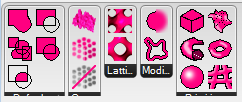

# Axolotl
Axolotl provides a small but growing set of volumetric modeling components for Rhino Grasshopper. They come as GH user objects and most of them are Python scripts.

Axolotl is also hosted on food4rhino: [food4rhino.com/app/axolotl](http://www.food4rhino.com/app/axolotl)

Join the community on grasshopper3d: [grasshopper3d.com/group/axolotl](http://www.grasshopper3d.com/group/axolotl)

## Keywords
signed distance fields (SDF), voxel, function representation (FRep), constructive solid geometry (CSG), implicit surfaces, lattice generation

## Installation
Copy the content of the folder `UserObjects` into the corresponding special folder of your Grasshopper installation. You should then see these icons appear in the `User` tab.

## Background
More about the research on volumetric modeling can be found here:
[dbt.arch.ethz.ch/research-stream/volumetric-modelling/](http://dbt.arch.ethz.ch/research-stream/volumetric-modelling/)

## Future
The idea is that this becomes a proper GH plugin one day. For now it is mainly a teaching tool, providing easy access to volumetric modeling with distance fields. All the components are just Python scripting components and the full code can be viewed and modified by double-clicking them.

## What people say
- "Kind of confusing/sloppy plug-in, the description sounded cool but seems little  half baked." *(Ben Finkle)*
- "MAN THIS IS INCREDIBLE" *(Marco Angrisani)*
- "I find this really cool!" *(Guilio Piacentino, McNeel)*

## Authors
DBT - Digital Building Technologies / ITA - Institute of Technology in Architecture / ETH Zurich / Mathias Bernhard / [bernhard@arch.ethz.ch](mailto:bernhard@arch.ethz.ch)
