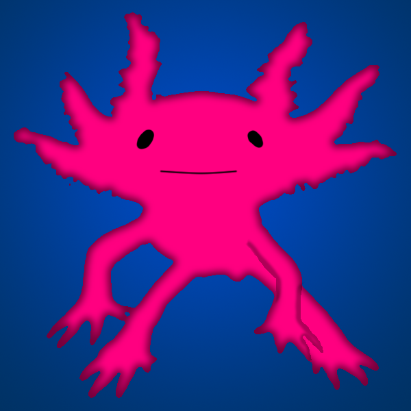

# Axolotl
Volumetric Modeling components for Rhino Grasshopper.

## Keywords
signed distance fiels, voxel, function representation (FRep), constructive solid geometry

## Installation
Copy the content of the folder `UserObjects` into the corresponding special folder of your Grasshopper installation. You should then see these icons appear in the User tab.

## Background
More about the research on volumetric modeling can be found here:
[dbt.arch.ethz.ch/research-stream/volumetric-modelling/](http://dbt.arch.ethz.ch/research-stream/volumetric-modelling/)

## Future
The idea is that this becomes a proper GH plugin one day. The (preliminary) project name is **Axolotl**.

## Author
DBT - Digital Building Technologies / ITA / ETH Zurich / Mathias Bernhard / [bernhard@arch.ethz.ch](mailto:bernhard@arch.ethz.ch)
