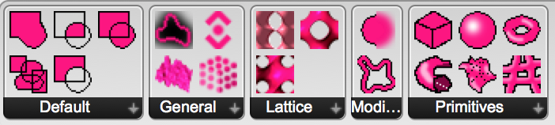

# Axolotl
Axolotl provides a ~~small but~~ growing set of volumetric modelling components for Rhino Grasshopper. They come as GH user objects and most of them are Python scripts. The range of possible applications is quite broad, it can do a lot of things. It is not fast! It is thought and used as a teaching resource.

Axolotl is also hosted on food4rhino: [food4rhino.com/app/axolotl](http://www.food4rhino.com/app/axolotl)

Join the community on grasshopper3d: [grasshopper3d.com/group/axolotl](http://www.grasshopper3d.com/group/axolotl)

## Changelog
* 18|08|06: new components: gradient vector field, shortest path (Dijkstra's algorithm)
* 18|05|03: new component: meta-ball (finally 😉, the "Hello, World!" of voxel modelling...), additional lattice truss pattern
* 18|04|11: new component: spatial lattice truss in unit cubes (tubular lines)
* 18|03|30: new components: combination operators by MERCURY, export layer as image
* 18|03|19: new components: distance field from mesh (thanks Patrick); cylinder from plane, radius and height
* 18|03|12: proper Axolotl tab, input check, error handling, more lattice components, new GDF component
* 18|02|28: No dependency on any 3rd party plugins (Millipede) anymore. Axolotl now has its own isosurface component.

## Keywords
signed distance fields (SDF), voxel, function representation (FRep), constructive solid geometry (CSG), implicit surfaces, lattice generation

## Installation
Copy the content of the folder `UserObjects` into the corresponding special folder of your Grasshopper installation (Grasshopper: File > Special Folders > User Object Folder). You should then see a new tab `Axolotl` appear in the GH toolbar, containing the Axolotl components.
As most of the user objects are Python scripting components, you will also need to install GHPython plugin from here: [food4rhino.com/app/ghpython](http://www.food4rhino.com/app/ghpython)

## Background
More about the research on volumetric modelling can be found here:
[dbt.arch.ethz.ch/research-stream/volumetric-modelling/](http://dbt.arch.ethz.ch/research-stream/volumetric-modelling/)

## Future
The idea is that this becomes a proper GH plugin one day. For now it is mainly a teaching tool, providing easy access to volumetric modelling with distance fields. All the components are just Python scripting components and the full code can be viewed and modified by double-clicking them.

## What people say
- "Kind of confusing/sloppy plug-in, the description sounded cool but seems little half baked." *(Ben Finkle)*
- "MAN THIS IS INCREDIBLE" *(Marco Angrisani)*
- "I find this really cool!" *(Giulio Piacentino, McNeel)*

## Authors
DBT - Digital Building Technologies / ITA - Institute of Technology in Architecture / ETH Zurich / Mathias Bernhard / [bernhard@arch.ethz.ch](mailto:bernhard@arch.ethz.ch)
