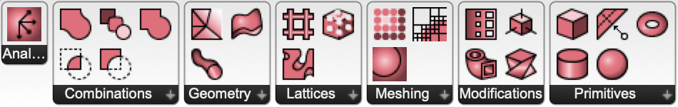

# Axolotl
Axolotl provides a set of volumetric modelling components for Rhino Grasshopper. They come as GH user objects and most of them are Python scripts. The range of possible applications is quite broad, it can do a lot of things. It is not fast! It is thought and used as a teaching resource.

Axolotl is also hosted on food4rhino: [food4rhino.com/app/axolotl](http://www.food4rhino.com/app/axolotl)

Join the community on grasshopper3d: [grasshopper3d.com/group/axolotl](http://www.grasshopper3d.com/group/axolotl)

Axolotl is continuously being developed at Digital Building Technologies DBT / ETH Zurich as a [project](http://dbt.arch.ethz.ch/project/axolotl/), part of a [research stream](http://dbt.arch.ethz.ch/research-stream/volumetric-modelling/).

More about the research on volumetric modelling can be found here:
[dbt.arch.ethz.ch/research-stream/volumetric-modelling/](http://dbt.arch.ethz.ch/research-stream/volumetric-modelling/)

## Changelog

* 191027: clean up, new marching cube from dense grid, some speed improvements
* 191019: lattice component ported to 2.0 (thanks, @tetov)
* 190710: many new components
  * "real" gradient calculation added, on panel "Analysis"
  * **axGradient** renamed to **axOverlay**
  * distance field from mesh
  * distance field from surface
  * mesh, surface and pipe on new panel "Geometry"

[Documentation](documentation.md)

## Keywords
signed distance fields (SDF), voxel, function representation (FRep), constructive solid geometry (CSG), implicit surfaces, lattice generation

## Installation
Copy the content of the folder [UserObjects](UserObjects) into the corresponding special folder of your Grasshopper installation (Grasshopper: *File > Special Folders > User Object Folder*). You should then see a new tab `Axolotl2` appear in the GH toolbar, containing the Axolotl components.
As most of the user objects are Python scripting components, you will also need to install GHPython plugin from here: [food4rhino.com/app/ghpython](http://www.food4rhino.com/app/ghpython)

## What people say
- "Kind of confusing/sloppy plug-in, the description sounded cool but seems little half baked." *(Ben Finkle)*
- "MAN THIS IS INCREDIBLE" *(Marco Angrisani)*
- "I find this really cool!" *(Giulio Piacentino, McNeel)*

## Authors
DBT - Digital Building Technologies / ITA - Institute of Technology in Architecture / ETH Zurich / Mathias Bernhard / [bernhard@arch.ethz.ch](mailto:bernhard@arch.ethz.ch) / github: [worbit](https://github.com/worbit)
