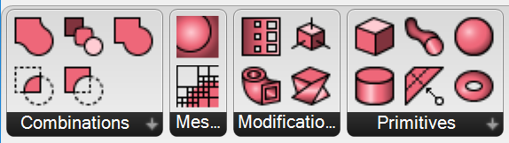

# Axolotl 2.0

* complete rework
* new icon set
* not (yet) backwards compatible
* not all components translated (yet)
* some new components not in 1.x

## Documentation
* [Primitives](#primitives)
* [Combinations](#combinations)
* [Modifications](#modifications)
* [Meshing](#meshing)

### Primitives

| Icon | Name | Description | Inputs | Output(s) |
| :--- | :--- | :--- | :--- | :--- |
|  | axSphere | Creates a shere | r: sphere radius | d: the sphere object (sdf) |
|  | axBox | Creates a box with an optional edge fillet. | a: length along the x axis   b: length along the y axis   c: length along the z axis   r: edge fillet radius | d: the box object (sdf) |
|  | axCylinder | Creates a cylinder. | r: radius of the cylinder   h: height of the cylinder | d: the cylinder object (sdf) |
|  | axTorus | Creates a torus. | r1: radius of the "donut" (axis)   r2: radius of the pipe | d: the torus object (sdf) |
|  | axPipe | Creates a pipe along a curve. | c: the axis curve   r1: radius at the start of the curve   r2: radius at the end of the curve | d: the pipe object (sdf) |
|  | axPlane | Creates a series of planes. | n: list of normal vectors   o: offset distance from the origin | d: the plane objects (sdf) |

### Combinations

| Icon | Name | Description | Inputs | Output(s) |
| :--- | :--- | :--- | :--- | :--- |
|  | axUnion | Creates a Boolean union. | a: list of / single sdf object(s)   b: second sdf object | d: the union object (sdf) |
|  | axIntersection | Creates a Boolean intersection. | a: list of / single sdf object(s)   b: second sdf object | d: the intersection object (sdf) |
|  | axSubtraction | Creates a Boolean subtraction `a-b`. | a: sdf object to subtract from   b: sdf object to subtract | d: the intersection object (sdf) |
|  | axBlend | Creates a smooth blend union. | a: first sdf object   b: second sdf object   f: smoothing factor (default 2.0) | d: the blend object (sdf) |
|  | axMorph | Morphs one object into another object. | a: first sdf object   b: second sdf object   f: morphing factor   f=0>d=a, f=1>d=b   `d=(1-f)*a+f*b` | d: the intermediate object (sdf) |

### Modifications

| Icon | Name | Description | Inputs | Output(s) |
| :--- | :--- | :--- | :--- | :--- |
|  | axTransform | Applies a matrix transformation to an object. | x: the sdf object to be transformed   m: the 4x4 transformation matrix (e.g. translation, rotation, shear...) | d: the transformed object (sdf) |
|  | axShell | Creates a shell from a solid. | x: the solid sdf object   t: thickness of the shell   s: side factor (1: inside, 0.5: half/half, 0: outside) | d: the shell object (sdf) |
|  | axTwist | Creates a twist object (works only for those who have a get_bounds method). | x: the solid sdf object to be twisted   a: the twist angle | d: the twist object (sdf) |
|  | axGradient | Creates a gradient by adding a fraction of object b to object a. | a: the base sdf object (modified)   b: the object to be added (modifier)   f: intensity factor   `d = a + f * b`, default: 0.01 | d: the modified object (sdf) |

### Meshing

| Icon | Name | Description | Inputs | Output(s) |
| :--- | :--- | :--- | :--- | :--- |
|  | axOctree | Creates a sparse voxel octree (SVO) subdivision. | x: the sdf object used for distance calculation   p: the center point of the root node (default: 0,0,0)   d: the edge length of the root node (default: 6.0)   n: the maximum number of subdivisions (default: 4) | t: the octree object, `t.leafs` is a list of leaf nodes (for MC meshing) |
|  | axMarchingCubes | Creates a marching cubes isosurface. | t: the subdivided octree | m: the isosurface mesh   p: the leaf node center points (for debugging) |
